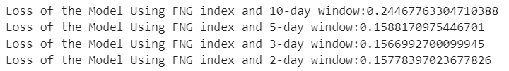
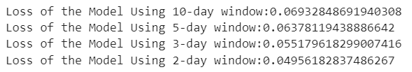
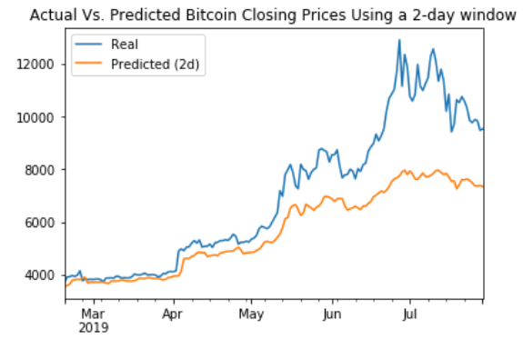
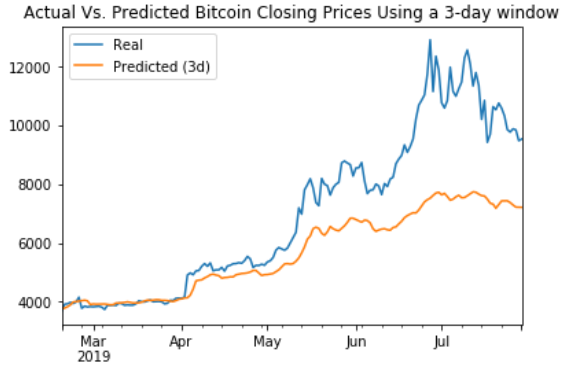
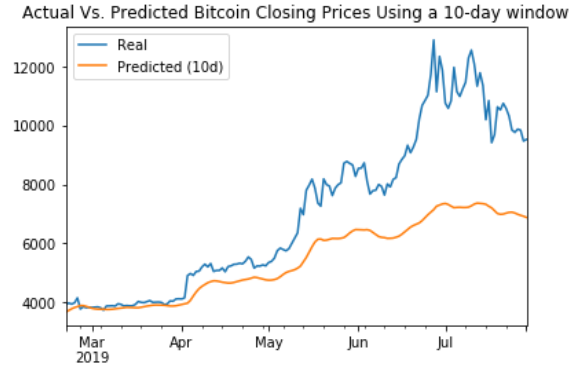
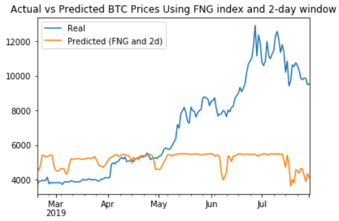
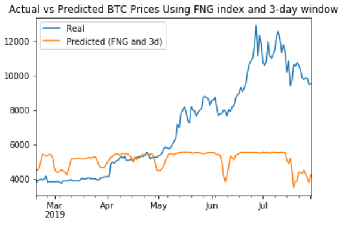
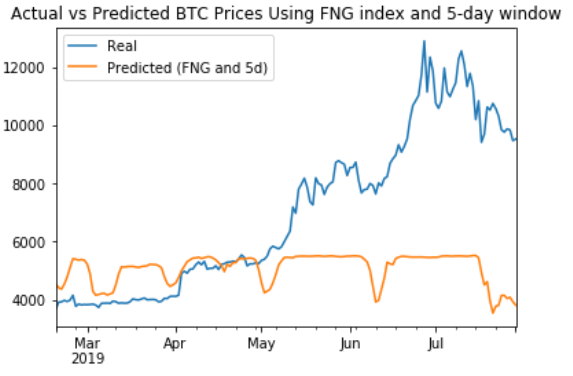
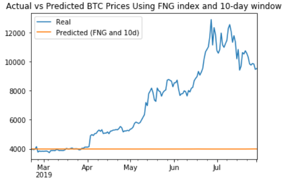

# Deep Learning - LSTM Stock Predictor using RNN
## By Franklin Vaca

Use of Deep Learning techniques: LSTM - Long short-term memory - RNN Recurrent Neural Networks and FNG (Crypto and Fear) Index to predict closing prices in Bitcoin.
The results presented here were extracted from two jupyter notebooks: lstm_stock_predictor_fng.ipynb and lstm_stock_predictor_closing.ipynb located in the Starter_files folder of this repository.

## **Considerations for the analysis:**

Two models were built using deep learning recurrent neural networks to model bitcoin closing prices. The first model uses FNG indicators to predict the closing price while the second model uses a window of closing prices to predict the nth closing price. The window sizes and batch sizes used on both models are:

- Four window sizes (10-day, 5-day, 3-day and 2-day) 

- Four batch sizes (90, 50, 10 and 1) 

These variations in window and batch size were used in both models to evaluate the window and batch size that had the smaller loss.

The batch size:1 was selected for the predictions because it offered the smaller loss when comparing the FNG and the closing models side by side.

Date: 10/08/2021

## **Model Comparison**
### **1. Which model has a lower loss?** 
>
Overall, the closing-prices model had lower losses compared to the FNG model. The closing-prices model using a 2-day window had the lowest loss at: 0.0495. The different loss values by model and window are:  
 

*Loss of the FNG models using different time-windows* 

 

*Loss of the Closing-price models using different time-windows* 

 

### **2. Which model tracks the actual values better over time?** 
>
The closing-prices model seems to track the actual closing values of Bitcoin better. The plots below show that the closing-prices model makes a better job at mimicking the behavior of Bitcoin prices overtime. The 2-day closing-prices model has the lowest loss and could predict bitcoin closing prices better than the rest of the models analyzed.
 

## *Closing-prices Model Plots:* 

 

## *Fear and Greed (FNG) Model Plots:* 

 

>
The Fear and Greed index model seems to capture the downward trends of Bitcoin prices but does not capture price increases.
 

 

### **3. Which window size works best for the model?** 
>
 The 2-day window in the closing-price model had the lowest loss at: 0.0495. Among the FNG model, the use of a 3-day window had performed slightly better than the rest, having the smallest loss (0.1566) across the FNG models.

>
Overall, the closing-price model with a 2-day window was the better predictor for Bitcoin closing prices.

 

*Loss of the Closing-price models using different time-windows* 

 
*Loss of the FNG models using different time-windows* 

 

